<h2>TensorFlow-FlexUNet-Image-Segmentation-Couinaud-Liver (2026/09/09)</h2>
Sarah T. Arai 
Software Laboratory antillia.com  
This is the first experiment in Image Segmentation for <b>Couinaud-Liver</b> based on our 
<a href="https://github.com/sarah-antillia/TensorFlow-FlexUNet-Image-Segmentation-Model"><b>TensorFlowFlexUNet Model</b></a> 
(TensorFlow Flexible UNet Image Segmentation Model for Multiclass), 
and a 512x512 pixels PNG 
<a href="https://drive.google.com/file/d/1yT5AX1qwbcJOQ73DWlYcu2DJQf2ldajK/view?usp=sharing">
<b>Couinaud-Liver-ImageMask-Dataset.zip</b></a> with colorized masks (<a href="https://creativecommons.org/licenses/by-sa/4.0/deed.en">CC-BY-SA 4.0</a>), 
which was derived by us from the Kaggle website  
<a href="https://www.kaggle.com/datasets/louisgv/couinaud-liver-segmentation">
<b>Couinaud Liver Segmentation</b>
</a>
 
<b>Segmentation from CT Volumes on Liver</b> 
by Louis-Gv and 1 collaborator.
 
 

<b>Actual Image Segmentation for Couinaud-Liver Images of 512x512 pixels </b> 
As shown below, the inferred masks predicted by our segmentation model trained on the dataset appear similar 
to the ground truth masks except for the first case.  
<table >
<tr>
<th>Input: image</th>
<th>Mask (ground_truth)</th>
<th>Prediction: inferred_mask</th>
</tr>
<tr>
<td>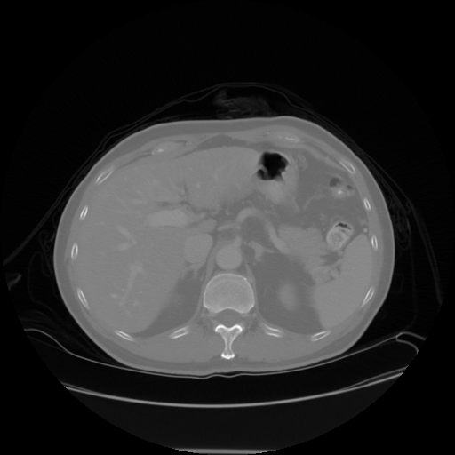</td>
<td>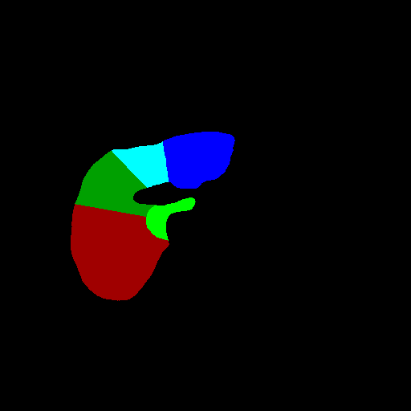</td>
<td>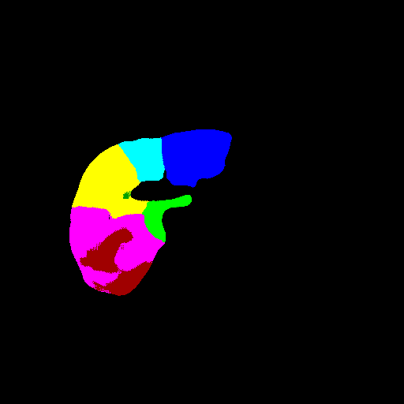</td>
</tr>
<tr>
<td>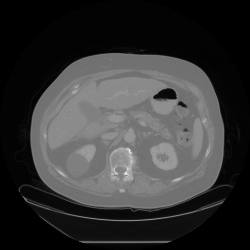</td>
<td>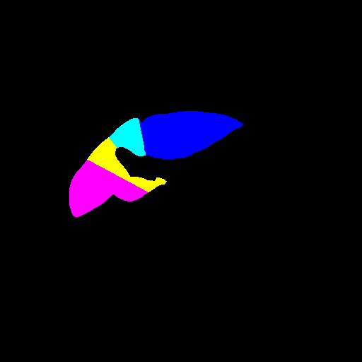</td>
<td>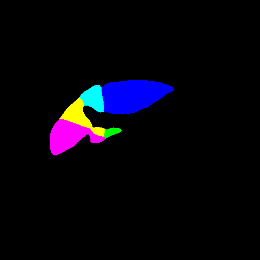</td>
</tr>
<tr>
<td>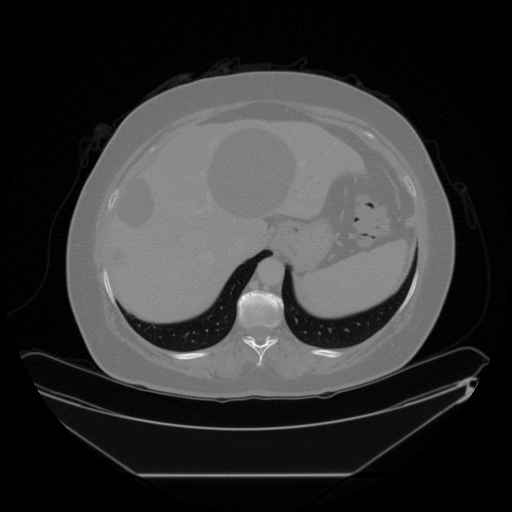</td>
<td></td>
<td>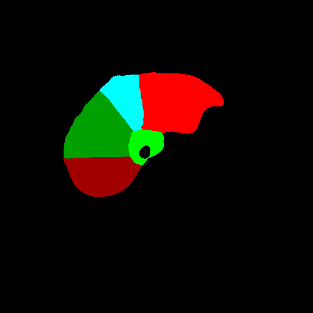</td>
</tr>
</table>

<b>class_color_mapping_table</b>  
<table border=1 style='border-collapse:collapse;' cellpadding='5'>
<tr><th>Indexed Color</th><th>Color</th><th>RGB</th><th>Class</th></tr>
<tr><td>1</td><td with='80' height='auto'></td><td>(0, 255, 0)</td><td>S1: Caudate lobe, located posteriorly and draining directly into the inferior vena cava.</td></tr>
<tr><td>2</td><td with='80' height='auto'></td><td>(0, 0, 255)</td><td>S2: Superior lateral left segment.</td></tr>
<tr><td>3</td><td with='80' height='auto'></td><td>(255, 0, 0)</td><td>S3: Inferior lateral left segment.</td></tr>
<tr><td>4</td><td with='80' height='auto'></td><td>(255, 255, 0)</td><td>S4: Medial left segment, divided into superior (IVa) and inferior (IVb) parts.</td></tr>
<tr><td>5</td><td with='80' height='auto'></td><td>(0, 255, 255)</td><td>S5: Inferior anterior right segment.</td></tr>
<tr><td>6</td><td with='80' height='auto'></td><td>(255, 0, 255)</td><td>S6: Inferior posterior right segment.</td></tr>
<tr><td>7</td><td with='80' height='auto'></td><td>(0, 0, 160)</td><td>S7: Superior posterior right segment.</td></tr>
<tr><td>8</td><td with='80' height='auto'></td><td>(0, 160, 0)</td><td>S8: Superior anterior right segment. </td></tr>
</table>
 
<h3>1  Dataset Citation</h3>
The dataset used here was derived from   
<a href="https://www.kaggle.com/datasets/louisgv/couinaud-liver-segmentation">
<b>Couinaud Liver Segmentation</b>
</a>
 
<b>Segmentation from CT Volumes on Liver</b> 
by Louis-Gv and 1 collaborator.
  
The following explanation was taken from the website above.
  
The segmentation of the liver sectors represents about 20 minutes of work for a radiologist.
  
<b>Data sources</b> 
<ul>
<li>
Images from : <a href="http://medicaldecathlon.com/">Medical Segmentation Decathlon: Task08_HepaticVessel</a> 
License: <a href="https://creativecommons.org/licenses/by-sa/4.0/deed.en">CC-BY-SA 4.0</a>
</li>
<li>
Annotations from : <a href="https://github.com/GLCUnet/dataset">GLCUnet/dataset</a>  
License: <a href="https://opensource.org/license/mit">MIT</a>
</li>
</ul>
For more information on <b>Couinaud classification</b>, please refer to <a href="https://radiopaedia.org/articles/couinaud-classification-of-hepatic-segments">
<b>Couinaud classification of hepatic segments</b></a>, and see also 
<a href="https://sonographictendencies.com/2020/02/10/couinauds-liver-segments/">
<b>Couinaud’s Liver Segments.</b>
</a>
 
 
<h3>
2 Couinaud-Liver ImageMask Dataset
</h3>
 If you would like to train this Couinaud-Liver Segmentation model,
please down load our dataset <a href="https://drive.google.com/file/d/1yT5AX1qwbcJOQ73DWlYcu2DJQf2ldajK/view?usp=sharing">
<b>Couinaud-Liver-ImageMask-Dataset.zip</b>
</a> on Google Drive.
Expand the downloaded and put it under <b>./dataset/</b> to be:
<pre>
./dataset
└─Couinaud-Liver
    ├─test
    │   ├─images
    │   └─masks
    ├─train
    │   ├─images
    │   └─masks
    └─valid
         ├─images
         └─masks
</pre>
 
<b>Couinaud-Liver Statistics</b> 
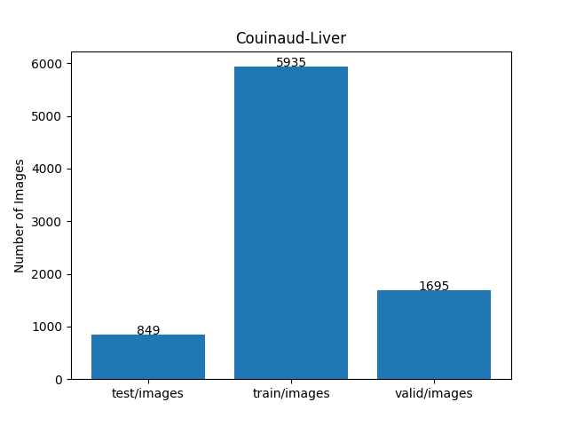 
 
As shown above, the number of images of train and valid datasets is large enough to use as the training set for our segmentation model.
  
<b>Train_sample images</b> 
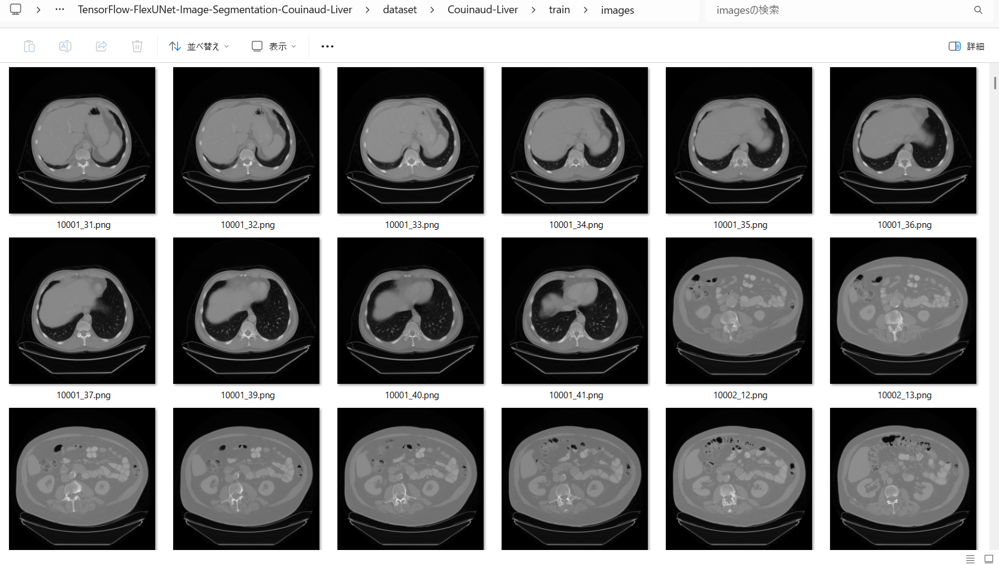
 
<b>Train_sample masks</b> 
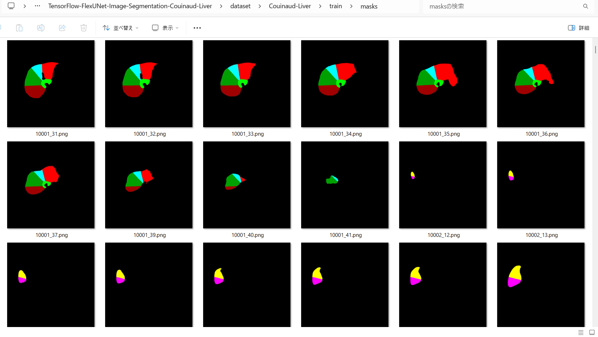
 
<h3>
3 Train TensorFlowFlexUNet Model
</h3>
 We trained the Couinaud-Liver TensorFlowFlexUNet Model by using the 
<a href="./projects/TensorFlowFlexUNet/Couinaud-Liver/train_eval_infer.config"> <b>train_eval_infer.config</b></a> file.  
Please move to the <b>./projects/TensorFlowFlexUNet/Couinaud-Liver</b> folder and run the following bat file. 
<pre>
>1.train.bat
</pre>
This simply runs the following command. 
<pre>
>python ../../../src/TensorFlowFlexUNetTrainer.py ./train_eval_infer.config
</pre>

<b>Model parameters</b> 
Defined a small <b>base_filters=16</b> and a large <b>base_kernels=(11,11)</b> for the first Conv Layer of Encoder Block of 
<a href="./src/TensorFlowFlexUNet.py">TensorFlowFlexUNet.py</a> 
and a large num_layers (including a bridge between Encoder and Decoder Blocks).
<pre>
[model]
image_width    = 512
image_height   = 512
image_channels = 3
input_normalize = True
normalization  = False
num_classes    = 9
base_filters   = 16
base_kernels  = (11,11)
num_layers    = 8
dropout_rate   = 0.05
dilation       = (1,1)
</pre>
<b>Learning rate</b> 
Defined a small learning rate.  
<pre>
[model]
learning_rate  = 0.00007
</pre>
<b>Loss and metrics functions</b> 
Specified "categorical_crossentropy" and "dice_coef_multiclass". 
<pre>
[model]
loss           = "categorical_crossentropy"
metrics        = ["dice_coef_multiclass"]
</pre>
<b >Learning rate reducer callback</b> 
Enabled the learning_rate_reducer callback and a small reducer_patience.
<pre> 
[train]
learning_rate_reducer = True
reducer_factor     = 0.4
reducer_patience   = 4
</pre>
<b>Early stopping callback</b> 
Enabled early stopping callback with the patience parameter.
<pre>
[train]
patience      = 10
</pre>
<b></b> 
<b>RGB color map</b> 
RGB color map dict for Couinaud-Liver 1+8 classes. 
<pre>
mask_datatyoe    = "categorized"
mask_file_format = ".png"
;Couinaud-Liver 1+8
rgb_map= {(0,0,0):0,(0,255,0):1,(255,0,0):2,(0,0,255):3,(0,255,255):4,\
          (255,255,0):5,(255,0,255):6,(160,0,0):7,(0,160,0):8}
</pre>
<b>Epoch change inference callbacks</b> 
Enabled epoch_change_infer callback. 
<pre>
[train]
epoch_change_infer     = True
epoch_change_infer_dir =  "./epoch_change_infer"
epoch_change_tiled_infer     = False
epoch_change_tiled_infer_dir =  "./epoch_change_tiled_infer"
</pre>
By using this epoch_change_infer callback, on every epoch_change, the inference procedure can be called
 for 6 images in <b>mini_test</b> folder. This will help you confirm how the predicted mask changes 
 at each epoch during your training process.    
<b>Epoch_change_inference output at starting (1,2,3)</b> 
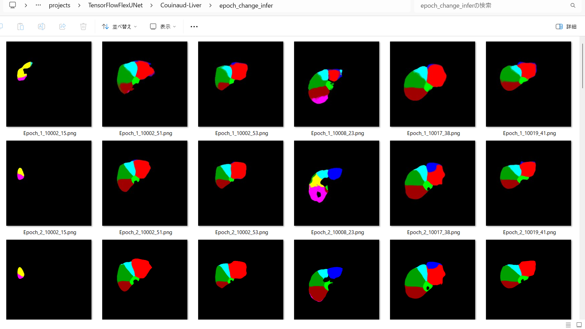 
 
<b>Epoch_change_inference output at middlepoint (13,14,15)</b> 
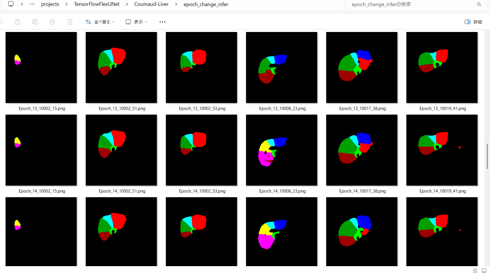 
 
<b>Epoch_change_inference output at ending (29,30,31)</b> 
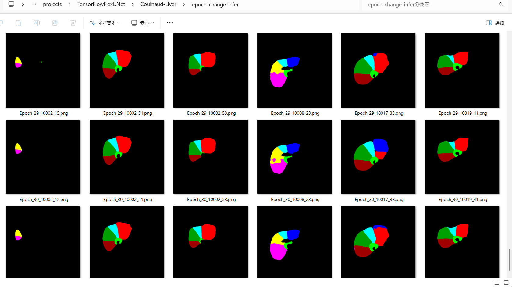 

 
In this experiment, the training process was stopped at epoch 31 by EarlyStoppingCallback.  
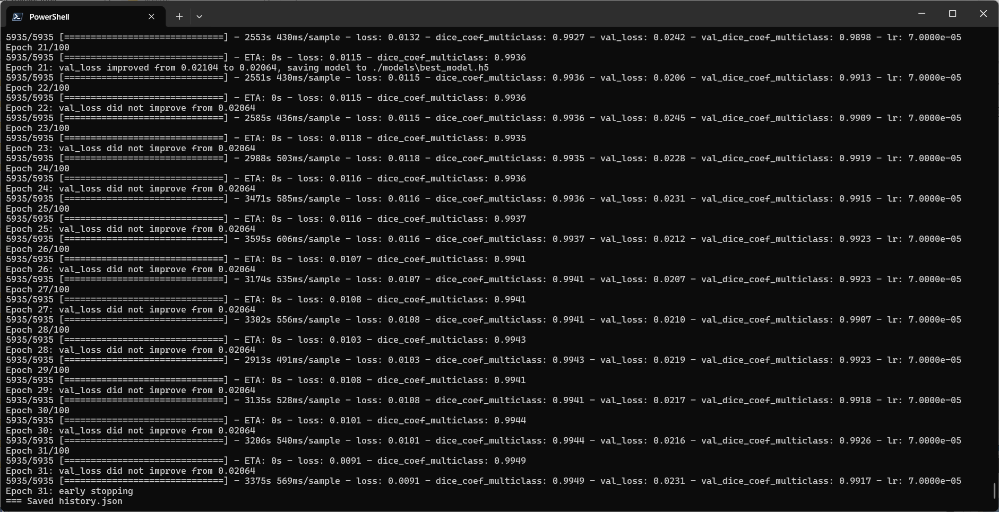 
 
<a href="./projects/TensorFlowFlexUNet/Couinaud-Liver/eval/train_metrics.csv">train_metrics.csv</a> 
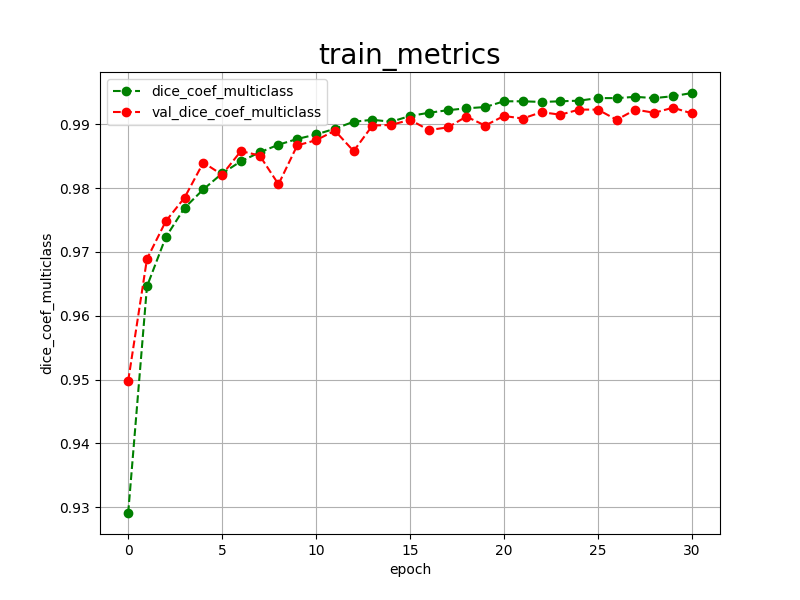 

 
<a href="./projects/TensorFlowFlexUNet/Couinaud-Liver/eval/train_losses.csv">train_losses.csv</a> 
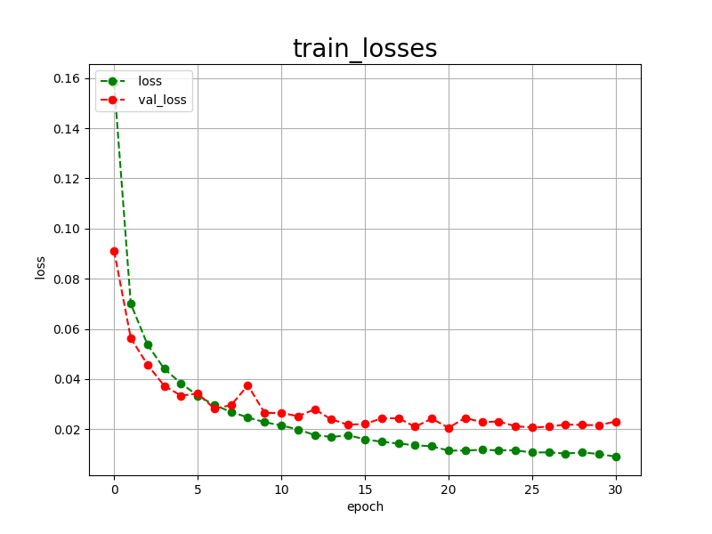 
 
<h3>
4 Evaluation
</h3>
Please move to  <b>./projects/TensorFlowFlexUNet/Couinaud-Liver</b> folder, 
and run the following bat file to evaluate the TensorFlowFlexUNet model for Couinaud-Liver. 
<pre>
>./2.evaluate.bat
</pre>
This simply runs the following command.
<pre>
>python ../../../src/TensorFlowFlexUNetEvaluator.py  ./train_eval_infer.config
</pre>
Evaluation console output: 
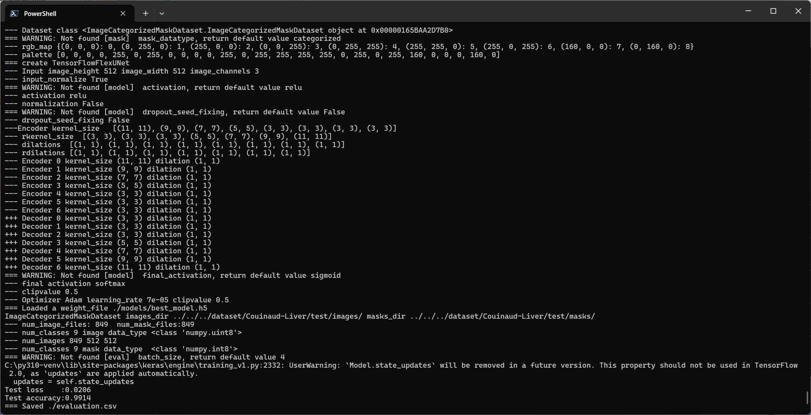
  Image-Segmentation-Couinaud-Liver

<a href="./projects/TensorFlowFlexUNet/Couinaud-Liver/evaluation.csv">evaluation.csv</a> 
The loss (categorical_crossentropy) to the  <b>Couinaud-Liver/test</b> was not low, but dice_coef_multiclass was
high, as shown below.
 
<pre>
categorical_crossentropy,0.0206
dice_coef_multiclass,0.9914
</pre>
 
<h3>5 Inference</h3>
Please move to the <b>./projects/TensorFlowFlexUNet/Couinaud-Liver</b> folder and run the following bat file to infer segmentation regions for images using the trained TensorFlowFlexUNet model for Couinaud-Liver. 
<pre>
>./3.infer.bat
</pre>
This simply runs the following command.
<pre>
>python ../../../src/TensorFlowFlexUNetInferencer.py ./train_eval_infer.config
</pre>

<b>mini_test_images</b> 
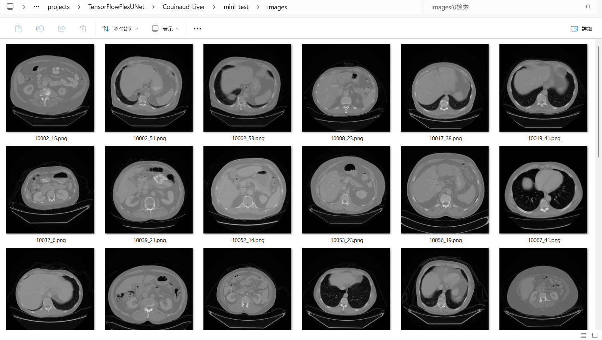 
<b>mini_test_mask(ground_truth)</b> 
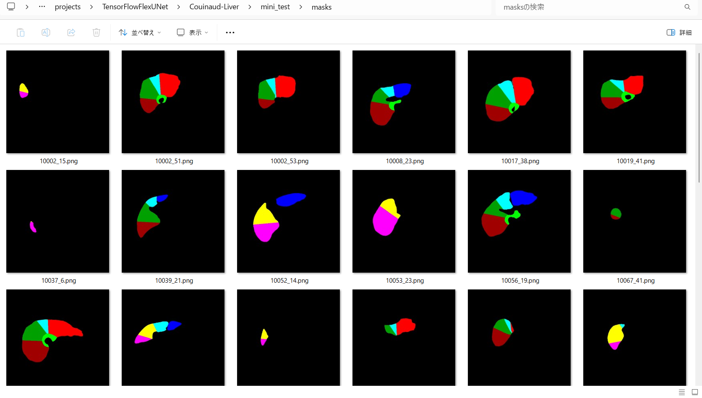 

<b>Inferred test masks</b> 
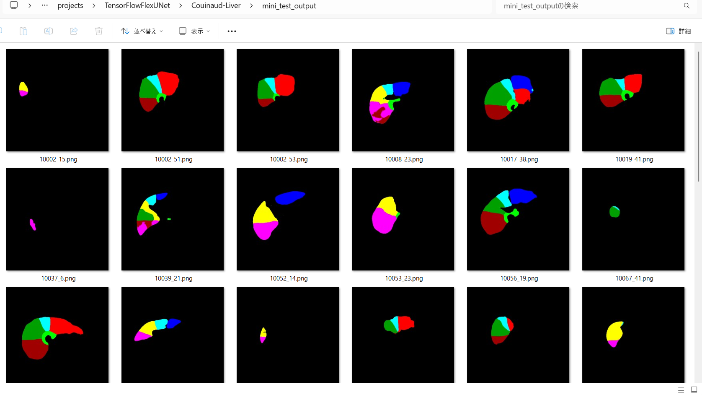 
 

<b>Enlarged images and masks for Couinaud-Liver  Images </b> 
As shown below, the inferred masks predicted by our segmentation model trained on the dataset appear similar 
to the ground truth masks.
  
<table>
<tr>
<th>Input: image</th>
<th>Mask (ground_truth)</th>
<th>Prediction: inferred_mask</th>
</tr>
<tr>
<td>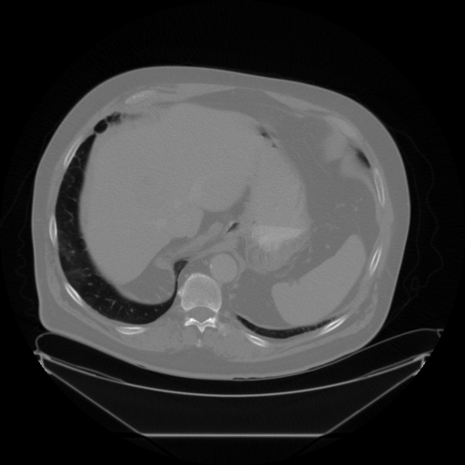</td>
<td>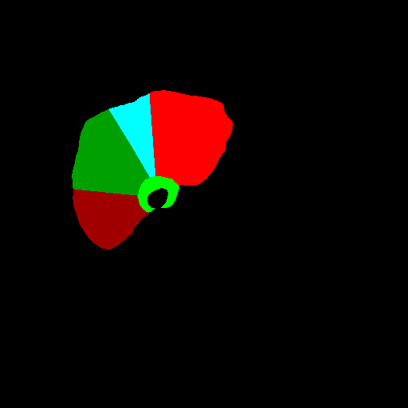</td>
<td></td>
</tr>
<tr>
<td>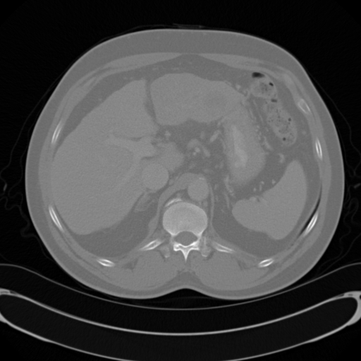</td>
<td>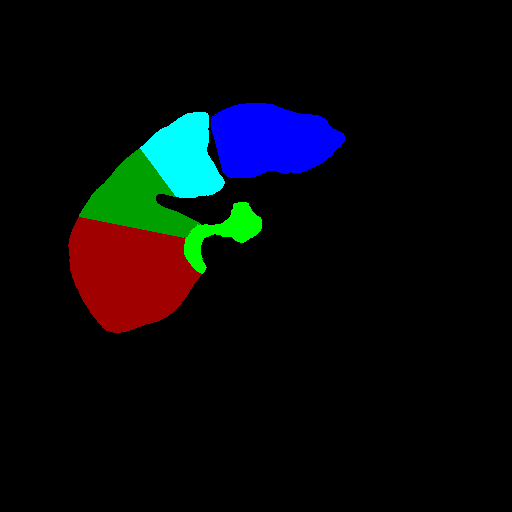</td>
<td></td>
</tr>
<tr>
<td>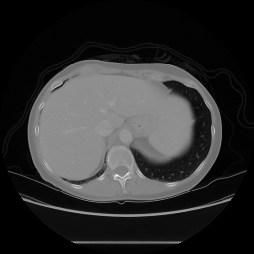</td>
<td>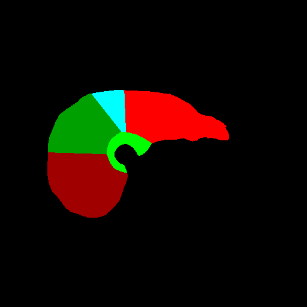</td>
<td>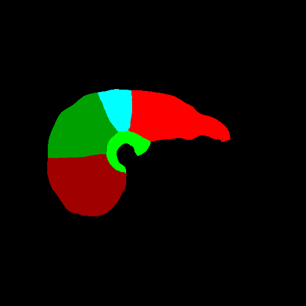</td>
</tr>
<tr>
<td>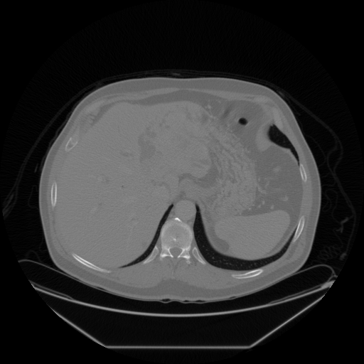</td>
<td>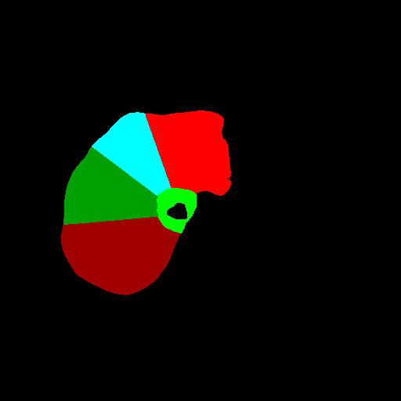</td>
<td>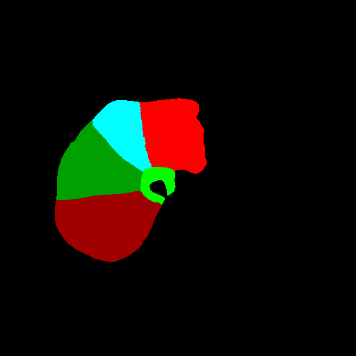</td>
</tr>
<tr>
<td>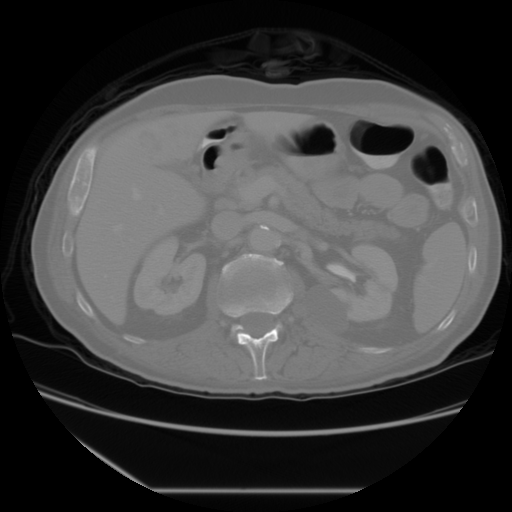</td>
<td>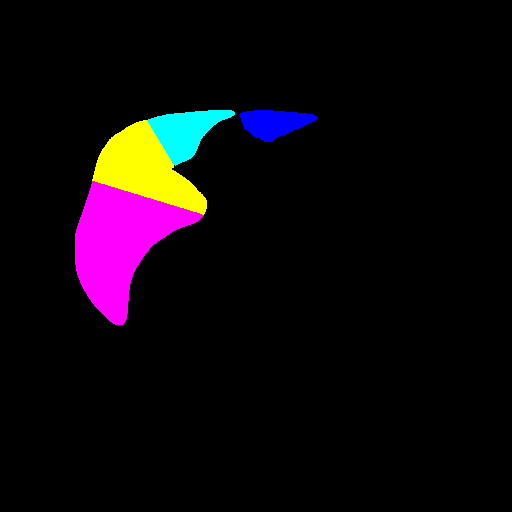</td>
<td>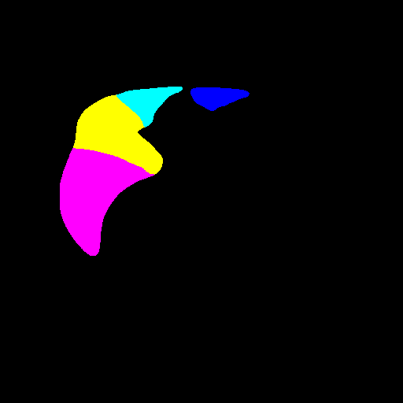</td>
</tr>
<tr>
<td>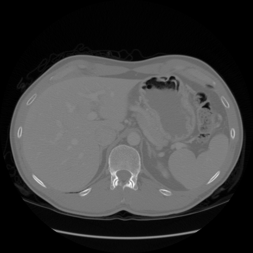</td>
<td>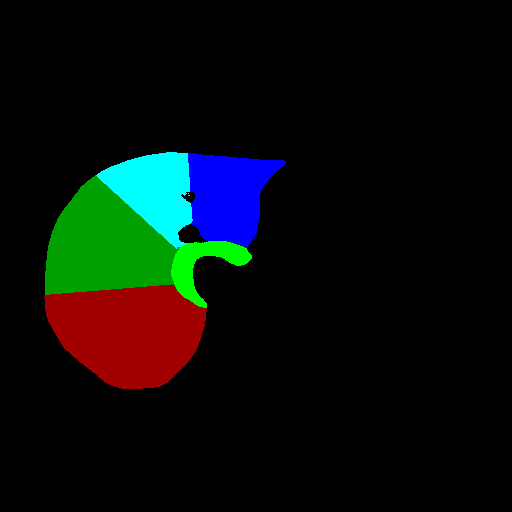</td>
<td></td>
</tr>
</table>

 
<h3>
References
</h3>
<b>1. Automatic liver Couinaud segmentation from computed tomography scans  
with a gradient-enhanced hierarchical cascade deep learning network</b> 
Seungyoo Lee BS, Kyujin Han BS, Hangyeul Shin BS, Seunghyun Kim HS, Harin Park BS,  
Jeonghoon Kim HS, Xiaopeng Yang PhD, Heecheon You PhD, Jisoo Song MD, PhD, 
Jae Do Yang MD, PhD, Hee Chul Yu MD, PhD  
<a href="https://www.sciencedirect.com/science/article/pii/S0011384025002394">
https://www.sciencedirect.com/science/article/pii/S0011384025002394
</a>
  
<b>2. Automatic Couinaud segmentation using AI and pictorial representation landmarking</b> 
Luis Miguel Núñez, Paul Aljabar, Sir Michael Brady 
<a href="https://pmc.ncbi.nlm.nih.gov/articles/PMC12971927/">https://pmc.ncbi.nlm.nih.gov/articles/PMC12971927/</a>
  
<b>3. VasGuideNet: Vascular Topology-Guided Couinaud Liver Segmentation with Structural Contrastive Loss </b> 
Chaojie Shen, Jingjun Gu, Zihao Zhao, Ruocheng Li, Cunyuan Yang, Jiajun Bu, Lei Wu 
<a href="https://arxiv.org/html/2602.21539v1">https://arxiv.org/html/2602.21539v1</a>
  
<b>4. Couinaud’s Liver Segments</b> 
Sonographic Tendencies 
<a href="https://sonographictendencies.com/2020/02/10/couinauds-liver-segments/">
https://sonographictendencies.com/2020/02/10/couinauds-liver-segments/</a>
 
 
<b>5. TensorFlow-FlexUNet-Image-Segmentation-Model</b> 
Toshiyuki Arai  
<a href="https://github.com/sarah-antillia/TensorFlow-FlexUNet-Image-Segmentation-Model">
https://github.com/sarah-antillia/TensorFlow-FlexUNet-Image-Segmentation-Model
</a>
 
 
